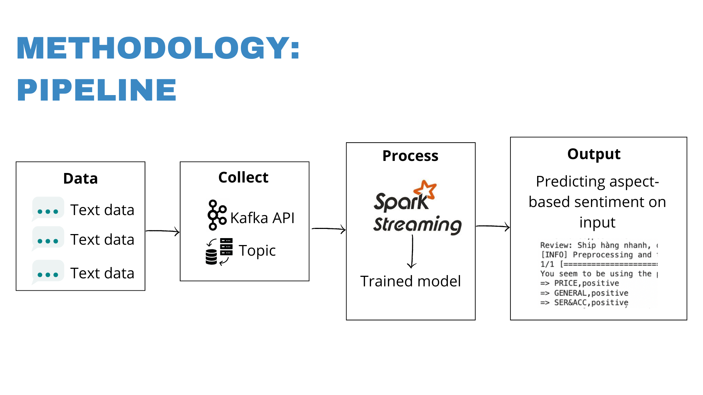

 <h1 align="center">Aspect-based Sentiment Analysis on smartPhone's Vietnamese Streaming Reviews using Apache Kafka platform</h1>

## Team members
* Lê Bá Đắc
* Nguyễn Thanh Quỳnh Tiên
* Dương Lý Tuyết Mai
* Nguyễn Thiện Bảo Châu

## Introduction

Here is my python source code for CustomerBot - a chatbot combines rule-based responses, machine learning, and recommendation system technologies for suporting customer on buying a product. With my code, you could: 
* **Extract and Analyze Reviews:** Automatically identify aspects of a product (e.g., design, price, service) mentioned in user reviews.
* **Perform Sentiment Analysis:** Determine the sentiment polarity (positive, negative, or neutral) for each identified aspect.
* **Streamline Feedback Insights:** Process and analyze large-scale streaming reviews in real-time using Apache Kafka.

## ABSA_Mobilephone

  

## Dataset
The dataset used for training PhoBERT is [UIT-ViSD4SA](https://github.com/kimkim00/UIT-ViSD4SA). We preprocess the data to ensure compatibility with the model."

## Methodology pipeline

  

